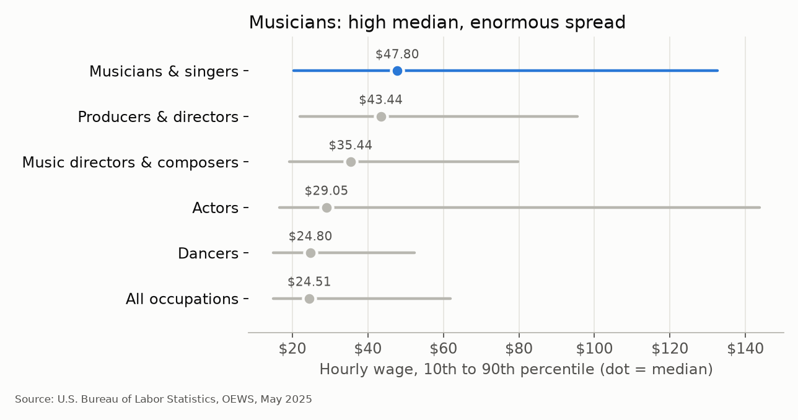
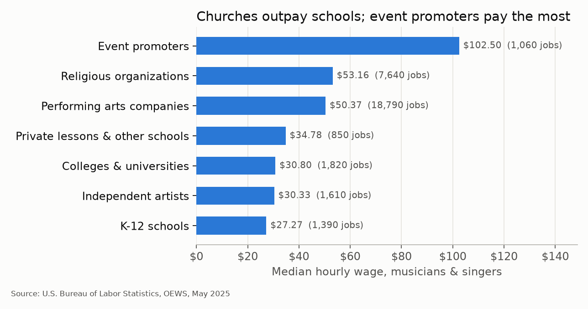
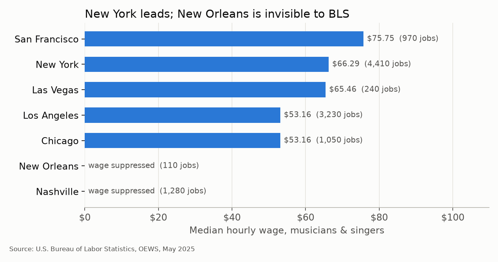
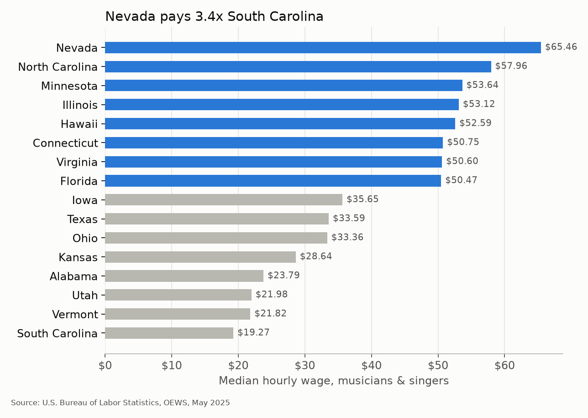
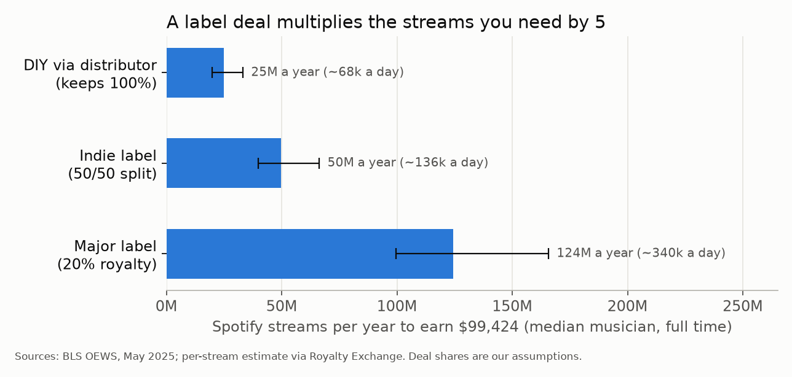
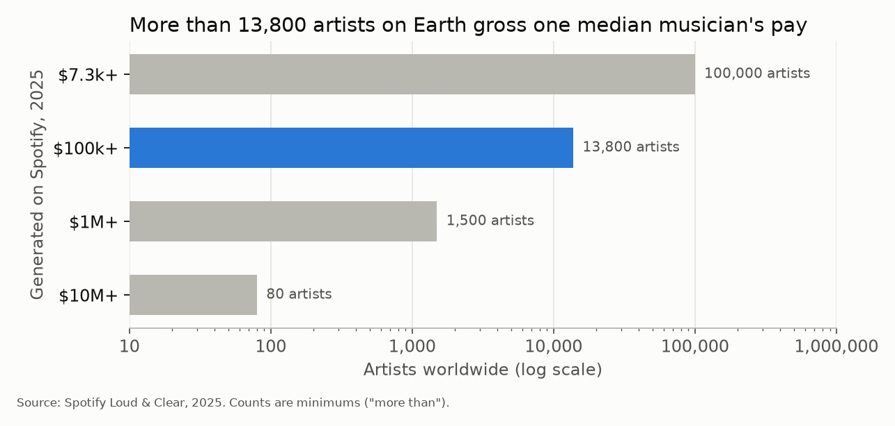
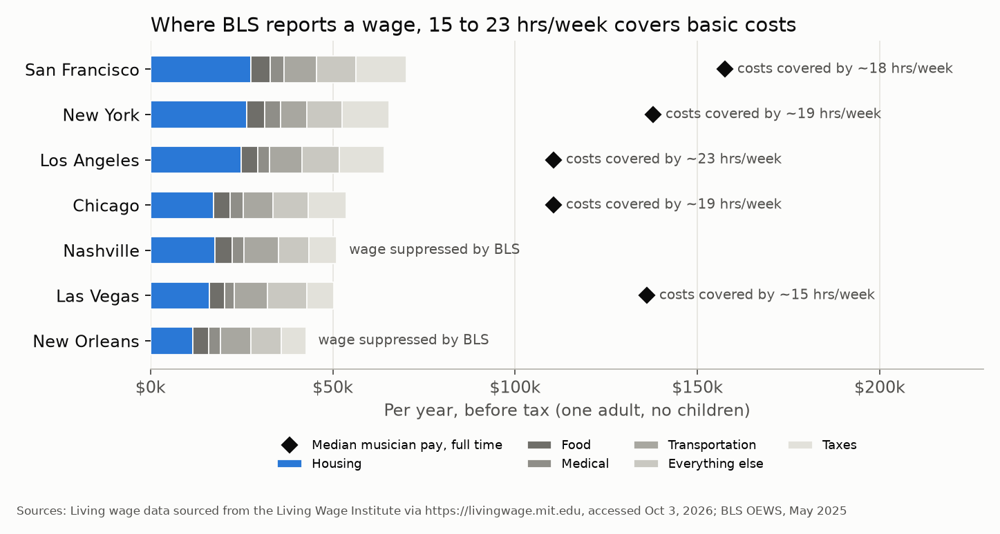
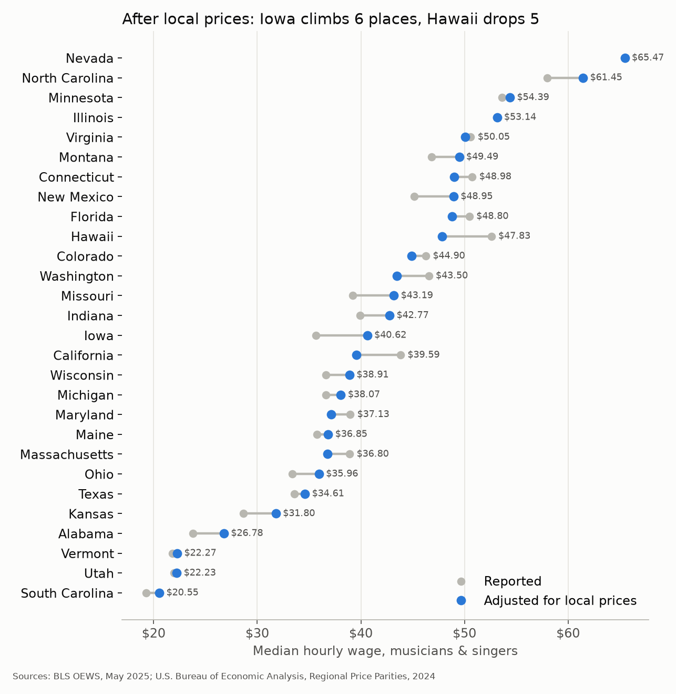
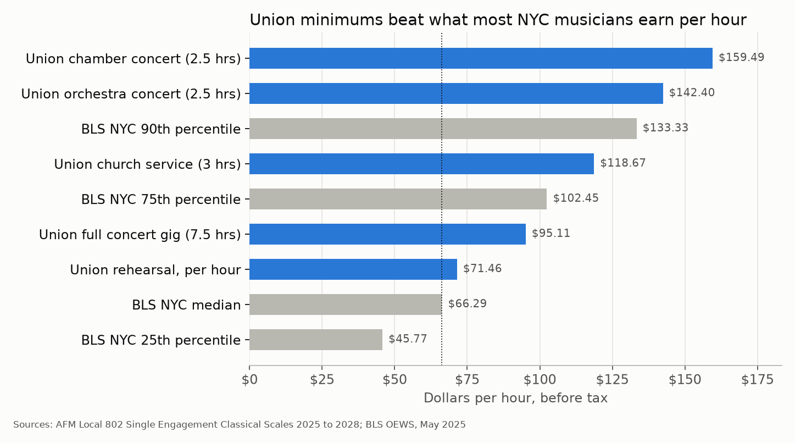
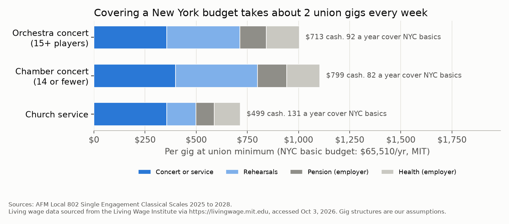

# Jazz Musician Economics

A data science project analyzing musician income and streaming/gig economics. General musician wage data is the analytical backbone, framed around jazz musicians specifically, with an explicit discussion of the limitation that no public dataset labels wages by music genre.

The biggest limitation shapes the whole project: very few jazz musicians have a steady job. The exceptions are chairs in ensembles like the Jazz at Lincoln Center Orchestra and Broadway pit orchestras. Everyone else lives gig to gig, paid in cash or as an independent contractor, and government wage data can't see that work. So each phase asks what the visible data says, and what it leaves out.

## Setup

1. `pip install -r requirements.txt`
2. Get the BLS wage data. BLS blocks automated downloads of its bulk files, so download it in your browser: https://www.bls.gov/oes/special-requests/oesm25all.zip
3. Unzip it so the file sits at `data/oesm25all/all_data_M_2025.xlsx` (about 80MB, kept out of git).
4. Run the phases in order: `python notebooks/phase1_wages.py`, then phases 2, 3 and 4. Phase 1 saves a small extract (`data/creative_occ_2025.csv`: SOC 27-2042 "Musicians and Singers" plus comparison jobs) that the later phases read. Phases 3 and 4 download their other data on the first run.

The BLS file has national, state, and metro-area wage percentiles (10th/25th/median/75th/90th) for all occupations.

## Phase 1 findings (BLS OEWS, May 2025)

Run it: `python notebooks/phase1_wages.py`. Charts are saved to `figures/`.

Two caveats shape everything below. OEWS only counts people on a payroll, so self-employed gig players (most working jazz musicians) are missing. BLS also publishes only hourly wages for musicians, because they typically work fewer than 2,080 hours a year and are paid by the hour, so every number here is hourly.

**1. Musicians earn the highest median of any performing job, with a huge range.** The median musician earns $47.80/hr, ahead of producers ($43.44), actors ($29.05) and dancers ($24.80). Across all arts and media jobs, only art directors ($55.22) and animators ($49.06) earn more. But the 90th percentile ($132.56) is 6.5 times the 10th ($20.35), compared with 4.1 times across all US jobs.

**2. Churches outpay schools.** Religious organizations employ 7,640 musicians at a $53.16 median, almost double K-12 schools ($27.27). Event promoters pay the most ($102.50) but employ only about 1,060.

**3. New York leads the jazz cities, and New Orleans is invisible.** New York has the most payroll musicians of any US metro (4,410, median $66.29). New Orleans has only 110, and BLS suppresses its wage entirely. That likely says more about cash gigs and self employment than about the size of the scene.

**4. Location matters a lot.** Nevada's median ($65.46; 240 of its 260 payroll musicians work in the Las Vegas metro) is 3.4 times South Carolina's ($19.27). Only 28 states have a median at all: BLS doesn't list 10 of the 50 states plus DC, and suppresses 13 more, including New York and Tennessee.

**Why do some states pay more?** Four things show up in the data.

- **Show business pays well but hires few.** 240 of Nevada's 260 payroll musicians work in the Las Vegas metro, where the musicians' union (AFM Local 369) has played for headliners and production shows on the Strip for decades and negotiates their pay. But casinos rarely put musicians on their own payroll. Nationwide, hotels (including casino hotels) employ just 50 payroll musicians, and the whole amusement and gambling industry 280. Show work comes through producers and promoters instead, and event promoters pay the highest median of any industry ($102.50, finding 2). Nevada also has fewer musicians per worker than the US average (a location quotient of 0.72, where 1.0 is average). So Nevada's top median comes from a small number of well paid show jobs. You won't find a big musician workforce there.
- **Tourism can mean more jobs instead.** Hawaii has the highest concentration of payroll musicians of any state, 5.1 times the national share (Honolulu: 5.4). Its median ($52.59) is high but isn't the top. A tourism economy is the likely reason, though BLS data can't show which employers these are.
- **Some of the gap is cost of living.** Expensive states pay more in dollars but less once you count local prices: Hawaii drops 5 places, Massachusetts 4 and California 3 (finding 8).
- **The ends of the ranking are the shakiest numbers.** BLS publishes an error estimate for each state's average wage. The two least reliable belong to the top and bottom states: Nevada (18%) and South Carolina (24%). With only about 260 and 330 payroll musicians in those states, treat the 3.4x gap as rough.

## Phase 2 findings: could streaming replace a paycheck?

Run it: `python notebooks/phase2_streaming.py` (uses the Phase 1 data cache). The model asks how many Spotify streams a year it takes to earn what the median payroll musician would earn working full time: $47.80/hr x 2,080 hrs = **$99,424**.

Inputs: Spotify does not pay a fixed rate per stream. It pays roughly two thirds of its music revenue to rights holders, split by each track's share of all streams. Third-party estimates put the average at about $0.003 to $0.005 per stream to the recording's rights holders (label or distributor). How much of that reaches the artist depends on the deal, and the 100%, 50% and 20% shares below are our assumptions. The 20% is in line with the UK competition regulator, which found new major label deals paid an average royalty of 19.7% to 23.3% of the label's streaming income (2012 to 2021). That rate applies before an advance is paid back, so an artist who hasn't recouped gets nothing until they do. 100% assumes a flat-fee distributor that takes no cut. We found no official source for a typical indie split, so 50/50 is a round illustration. Songwriting royalties are left out. Since April 2024, a track needs at least 1,000 streams in the previous 12 months to earn any royalties.

**5. A label deal multiplies the streams you need by 5.** A DIY artist needs about 25 million streams a year (roughly 68k a day). On a 20% major label royalty it is about 124 million.

**6. Only about 13,800 artists in the world clear that bar.** Spotify says more than 13,800 artists generated $100k+ in 2025. That money goes to the label or distributor first, so most of those artists take home less. The 100,000th ranked artist generated more than $7,300, which equals 153 hours (under 4 weeks) of median musician pay.

**What this means for jazz.** Jazz did not make the top 10 US genres by audio streams in Luminate's 2025 Year-End Music Report (as reported by @chartdata), whose last two spots went to Children's (#9) and Holiday (#10). A jazz player would need to be in the top tier of a small genre to match a median payroll wage from streaming alone. That is why gigs, teaching and church work (Phase 1) carry jazz careers.

## Phase 3 findings: does the pay cover the cost of living?

Run it: `python notebooks/phase3_cost_of_living.py` (downloads BEA and MIT data on first run, then caches it in `data/`).

Living costs come from the MIT Living Wage Calculator (2026 update): a basic yearly budget for one adult with no children, including taxes. BEA Regional Price Parities (2024) measure how expensive each state is compared to the US average.

**7. Where BLS reports a wage, 15 to 23 hours a week covers basic costs.** A basic New York budget adds up to $65,510 a year before tax, with housing the biggest piece. At New York's median musician wage ($66.29/hr) that takes about 19 hours of paid work a week. Las Vegas needs the fewest hours (15); Los Angeles the most (23). Nashville and New Orleans can't be checked because BLS suppresses their wages. Remember this is the median *payroll* musician. Steady paid hours are exactly what most gigging players lack.

**8. After local prices, Iowa climbs 6 places and Hawaii drops 5.** Dividing each state's median wage by its price level changes the ranking. Cheaper states like Iowa, New Mexico and Montana move up. Expensive ones like Hawaii, Massachusetts and California move down. Nevada stays first ($65.47 in US average dollars), with North Carolina second ($61.45).

## Phase 4 findings: what does a union gig pay?

Run it: `python notebooks/phase4_union_scales.py` (downloads the PDF once, then saves every parsed rate to `data/local802_scales.csv`).

AFM Local 802, the New York musicians' union, sets minimum pay ("scale") per service. Its club date and Broadway scales are for members only. That hurts: Broadway is one of the few places a jazz player can get steady union work, and its pay is exactly what we can't see. The public scale closest to them covers freelance classical concerts, chamber music and religious services, which also links back to the church finding in Phase 1. We use its first contract year (September 2025 to September 2026), the closest to BLS's May 2025 data.

**9. Union minimums beat what most New York musicians earn per hour.** A union orchestra concert pays at least $356.01 for up to 2.5 hours on stage, or $142.40 an hour, which is above the 90th percentile of New York payroll musicians ($133.33). Rehearsals pay less ($71.46 an hour), but even a whole gig with two rehearsals works out to $95.11 an hour, well above the New York median ($66.29). Scale only counts hours in the room. Practice, travel and the unpaid time between gigs are not in it.

**10. Covering a New York budget takes about 2 union gigs every week.** A gig here means one booking, not a steady job. Our assumption: a concert gig is two 2.5 hour rehearsals plus the concert, and a church gig is one 2 hour rehearsal on an earlier day plus the service (a same day rehearsal inside the service's 3 hour window is already included in the service fee). That makes an orchestra gig $713 in cash. On top of that the employer pays 17.99% into the union pension and $92.36 per show plus $34.67 per rehearsal into health insurance, so the true cost of the gig is about $1,003. Benefits don't pay rent, though, so we count cash only: 92 orchestra gigs, 82 chamber gigs or 131 church gigs a year to reach MIT's basic New York budget ($65,510). The hourly rate is generous. Getting hired that often is the hard part, which matches the low steady hours seen in Phases 1 and 3.

## Planned phases

- **Phase 1 (done), wage baseline:** national + state/metro wage distribution for musicians & singers (BLS OEWS), compared to other creative occupations and to jazz-hub cities (NYC, Chicago, New Orleans) specifically.
- **Phase 2 (done), streaming economics:** model musician income from streaming using published per-stream rate estimates (Spotify Loud & Clear report, Royalty Exchange rate estimate), for example "streams needed to earn $X/year."
- **Phase 3 (done), cost of living:** compare musician wages to MIT living costs in jazz cities and adjust state wages with BEA Regional Price Parities.
- **Phase 4 (done), union rates:** parse the public AFM Local 802 classical scale PDF and compare it to BLS wages and MIT living costs in New York.
- **Phase 5 (optional), jazz repertoire angle:** fold in the Kaggle "Jazz Standards" dataset for a music-content dimension alongside the economics analysis.

## Data sources
Accessed October 3 to 4, 2026.

- U.S. Bureau of Labor Statistics. Occupational Employment and Wage Statistics (OEWS), May 2025, all data file (SOC 27-2042, Musicians and Singers). https://www.bls.gov/oes/special-requests/oesm25all.zip. Hourly-only wages for musicians: "Field Descriptions" sheet in the same file. Coverage note (OEWS excludes the self employed): https://www.bls.gov/oes/oes_emp.htm
- Spotify. Loud & Clear 2025 (artist earnings tiers and the 100,000th artist). https://loudandclear.byspotify.com/takeaways/. How royalties are pooled ("streamshare"): https://loudandclear.byspotify.com/process/
- Spotify. Loud & Clear FAQ (no fixed per-stream rate; roughly two thirds of music revenue paid to rights holders). https://loudandclear.byspotify.com/faq/
- Royalty Exchange. "How Much Do Streaming Platforms Pay Per Stream" (third-party estimate, Spotify: $0.003 to $0.005), July 15, 2026. https://royaltyexchange.com/blog/how-much-do-streaming-platforms-pay-per-stream
- Spotify for Artists. Track monetization eligibility (1,000 stream threshold, April 2024). https://support.spotify.com/us/artists/article/track-monetization-eligibility/
- UK Competition and Markets Authority. Music and streaming: final report, November 29, 2022. Table 2.8, p. 45: average gross royalty rate in new major label artist contracts, 19.7% (2012) to 23.3% (2021), before recoupment. https://assets.publishing.service.gov.uk/media/6384f43ee90e077898ccb48e/Music_and_streaming_final_report.pdf
- Luminate. 2025 Year-End Music Report: https://luminatedata.com/reports/yearend-music-industry-report-2025/. The top 10 core genres by US audio streams were read secondhand from @chartdata, January 14, 2026: https://x.com/chartdata/status/2011464844604543155
- Living wage data sourced from the Living Wage Institute via https://livingwage.mit.edu/metros/35620 (New York), /metros/41860 (San Francisco), /metros/31080 (Los Angeles), /metros/16980 (Chicago), /metros/34980 (Nashville), /metros/29820 (Las Vegas) and /metros/35380 (New Orleans). Accessed on October 3, 2026. The Institute allows direct use of up to 10 locations with this citation; this project uses 7.
- U.S. Bureau of Economic Analysis. Regional Price Parities by State (SARPP), 2008 to 2024. https://apps.bea.gov/regional/zip/SARPP.zip
- Musicians Union of Las Vegas, AFM Local 369. About (Strip headliners and production shows; negotiates wages with employers). https://musicians.vegas/about/
- AFM Local 802. Single Engagement Classical Wage Scales & Conditions, effective September 12, 2025 through September 11, 2028 (PDF, not redistributed here; the script downloads it). https://www.local802afm.org/wp-content/uploads/2025/12/SINGLE-ENGAGEMENT-CLASSICAL-SCALES-2025-2028-v121625.pdf. All public contracts: https://www.local802afm.org/contracts/

Planned for Phase 5 (not used yet): Kaggle Jazz Standards dataset, https://www.kaggle.com/datasets/melihcanyardi/jazz-standards
